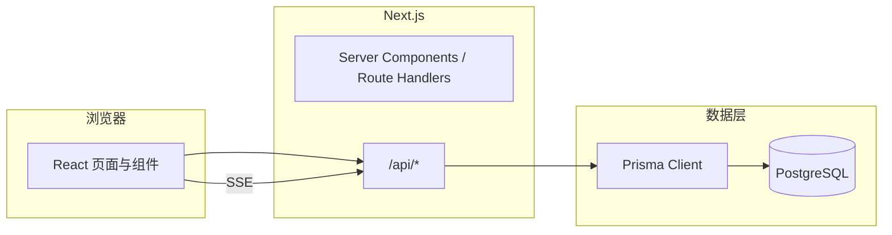
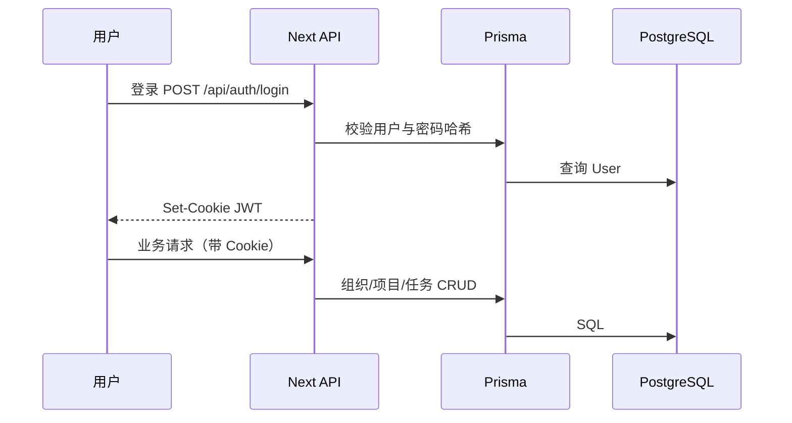

# 02-说明文档

本文档分两部分：**使用说明书**（面向最终使用者）与**技术实现说明书**（面向学习/研究者复刻同类工具）。内容依据当前仓库实现整理；部署与密钥以 `.env.example`、`DEPLOY.md` 为准。

---

## 第一部分：使用说明书

### 适用场景

**解决什么问题**

- 在「组织 → 项目 → 任务」结构下管理团队工作：任务看板/列表/甘特、负责人与协助人、截止日期与进度。
- 同一组织内成员可协作：项目权限、站内通知、私信（与对方均为本组织成员时）。
- 可选 **智能助手**：项目中把文字拆成任务草稿、工作报告与「我的任务」侧计划建议（由管理员为单位开通；未开通不影响常规录入）。界面会标明通过 **OpenRouter** 接入及当前**模型标识**。

**谁应该使用**

- **团队组织者 / 项目负责人**：创建组织与项目、拆分任务、分配负责人。
- **执行成员**：在个人「我的任务」里按状态/日历查看自己被指派的任务；在项目内更新状态与详情。
- **仅需协作沟通的用户**：通过「消息中心」查看通知与私信。

---

### 快速开始

#### 访问（线上）

1. 在浏览器打开管理员提供的站点根地址（需 **`https`**，且与后台配置的 `NEXT_PUBLIC_APP_URL` 一致）。
2. 若无账号：**注册** → 登录。
3. 登录后进入组织工作台（若暂无组织，按界面提示或由管理员邀请/创建）。

#### 本地安装（开发者或自托管）

前置：**Node.js**、**PostgreSQL**（或使用 Neon/Supabase 等云端库）。

```bash
git clone <仓库地址>
cd <项目目录>
npm install
cp .env.example .env   # 编辑 DATABASE_URL、DIRECT_URL、JWT_SECRET、NEXT_PUBLIC_APP_URL 等
npx prisma migrate deploy   # 或按 DEPLOY.md 首次同步库结构
npm run db:seed             # 可选：演示数据
npm run dev
```

浏览器访问 `http://localhost:3000`（与 `.env` 中 `NEXT_PUBLIC_APP_URL` 一致）。

#### 基本使用流程（示例）

1. **登录** → 进入 **组织工作台**。
2. 打开 **项目管理** → **新建项目** 或 **加入项目**（向负责人索取 **项目 ID**，在「加入项目」中粘贴）。
3. 进入项目 → 使用 **看板 / 列表 / 甘特** 等视图管理任务；点任务打开右侧 **任务详情**，编辑名称、状态、负责人、截止日期等（支持自动保存与「保存更改」）。
4. 在任务详情中点负责人或协助人旁的 **查看资料** → **前往消息中心发送消息**，在 **消息中心 → 私信** 中与对方聊天（记录保存在系统内）。
5. 侧边栏 **我的任务**：按「待办 / 进行中 / 已完成」等筛选，或使用 **日历** 查看截止日期。

**简单示例**：项目经理新建项目「Q2 上线」，创建任务「接口联调」，指定负责人为小王，截止日期设为本周五；小王在「我的任务 → 待办」中看到该任务，完成后将状态改为「已完成」。

---

### 功能说明（主要功能点）

| 模块 | 说明 |
|------|------|
| 账号 | 邮箱注册/登录、忘记密码（若配置邮件服务）、个人中心（头像、用户名、姓名、邮箱、本组织部门等） |
| 组织与项目 | 多组织；项目列表、创建项目、复制项目 ID、通过项目 ID 加入项目 |
| 项目工作台 | 看板（拖拽改状态）、列表、甘特图、报表、动态、智能任务解析（若单位已开通） |
| 任务 | 标题/描述、状态、优先级、起止日期、进度、负责人、协助人、任务内讨论（与私信独立） |
| 我的任务 | 按状态筛选、月历视图；可选「智能计划表」（若单位已开通） |
| 消息中心 | **通知与提醒**（系统通知）；**私信**（与同组织成员的 1v1，聊天记录持久化） |
| 工作报告 | 可选「智能工作报告」草稿（若单位已开通）；亦可自行撰写 |

---

### 常见问题

**Q：登录后跳转异常或 Cookie 无效？**  
A：检查浏览器地址是否与配置的 `NEXT_PUBLIC_APP_URL` 完全一致（协议、域名、端口）。

**Q：加入项目提示「项目不存在或不属于本组织」？**  
A：项目 ID 必须属于当前组织；请向负责人确认组织与项目 ID 是否正确。

**Q：私信发不出去或列表为空？**  
A：私信要求对方为**同一组织成员**；若刚加入组织，请确认对方已在该组织中。

**Q：智能助手相关功能不可用或按钮置灰？**  
A：由单位管理员在后台开通；未开通时请使用「新建任务」等常规方式。若您认为本单位应启用，请联系管理员。

**Q：演示账号（仅当执行过 `npm run db:seed`）？**  
A：以 `DEPLOY.md` / `prisma/seed.ts` 为准；文档编写时常见示例为 `demo@projecthub.io` / `demo123456`（生产环境请勿依赖默认密码）。

---

## 第二部分：技术实现说明书

### 整体架构

#### 技术选型及理由（摘要）

| 层次 | 选型 | 理由 |
|------|------|------|
| 前端框架 | **Next.js 14**（App Router）+ **React 18** | SSR/路由/API Routes 一体；适合 Vercel 等平台部署 |
| 语言 | **TypeScript** | 类型安全，便于维护中大型业务逻辑 |
| 样式 | **Tailwind CSS** | 与组件库类名快速迭代 UI |
| 数据访问 | **Prisma** + **PostgreSQL** | 关系型模型清晰；迁移可复现；Serverless 托管需 Postgres（非 SQLite） |
| 认证 | **jose**（JWT）+ **bcryptjs**（密码哈希）+ **HttpOnly Cookie** | 无状态会话 + 常见 Web 安全实践 |
| 校验 | **Zod** | API 入参校验 |
| 实时 | **SSE**（`/api/me/stream`、项目维度同步） | 比 WebSocket 更易穿透部分网关；满足推送类需求 |
| 拖拽 | **@dnd-kit** | 看板拖拽 |
| 图表 | **Recharts** | 项目内报表 |
| 部署 | **Vercel**（常见）+ **Neon/Supabase** 等 PG | `DEPLOY.md` 详述 `DATABASE_URL` / `DIRECT_URL` 分离 |

#### 核心流程（逻辑示意）





---

### 关键实现

#### 1. 目录与路由

- **`src/app`**：App Router 页面与布局；组织内路径形如 `org/[orgId]/...`。
- **`src/app/api`**：REST 风格 Route Handlers（认证、项目、任务、私信、AI 等）。
- **`src/components`**：按业务划分（如 `project/`、`org/`、`chat/`）。
- **`prisma/schema.prisma`**：核心模型（User、Organization、Project、Task、DirectThread、DirectMessage 等）。
- **`scripts/build.mjs`**：生产构建时执行 `prisma generate`、**`prisma migrate deploy`**（可用环境变量跳过迁移）、`next build`。

#### 2. 认证与权限

- 会话：**JWT** 写入 HttpOnly Cookie（参见 `src/lib/auth.ts`）。
- 组织/项目接口：通过 **`requireOrgMember`**、**`requireProjectAccess`**（`src/lib/access.ts`）校验成员关系后再操作。

#### 3. 任务与实时

- 任务详情 PATCH：`/api/tasks/[taskId]`（状态、负责人、协助人、日期等）。
- 项目内列表刷新、看板拖拽后 **PATCH**；**SSE** 用于项目内同步、任务讨论、私聊推送等（`src/hooks/useProjectRealtime.ts`、`useUserRealtime.ts`）。

#### 4. 私信与消息中心

- 线程模型：**DirectThread**（两用户 ID 排序后唯一）+ **DirectMessage**（`prisma/schema.prisma`）。
- 打开会话：项目内 historically `POST /api/projects/[projectId]/chat/dm/open`；消息中心路径使用 **`POST /api/orgs/[orgId]/chat/dm/open`**（校验双方均为该组织成员）。
- 列表：**`GET /api/orgs/[orgId]/dm-threads`**（仅展示对方亦在本组织的会话）。
- 发消息：**`POST /api/chat/dm/[threadId]/messages`**。

#### 5. AI（OpenRouter）

- 服务端通过 **`OPENROUTER_API_KEY`** 调用 OpenRouter HTTP API（参见 `src/lib/openrouter.ts` 及各处 `analyze` / `plan` / 报告路由）。
- 可选环境变量：`OPENROUTER_MODEL`、`OPENROUTER_FALLBACK_MODEL`、`OPENROUTER_HTTP_REFERER` 等（见 `.env.example`）。

#### 关键配置片段（示例，勿将真实密钥提交仓库）

```env
DATABASE_URL="postgresql://..."
DIRECT_URL="postgresql://..."
JWT_SECRET="至少32字符的随机串"
NEXT_PUBLIC_APP_URL="https://你的域名"
OPENROUTER_API_KEY="sk-or-v1-..."
```

```json
// vercel.json（节选）
{
  "framework": "nextjs",
  "buildCommand": "npm run build"
}
```

#### 关键决策说明

| 决策 | 说明 |
|------|------|
| Postgres + 双连接串 | 连接池用于运行时；直连用于迁移，避免 Pooler 上 advisory lock 问题 |
| 私信按用户对存储 | 与项目解耦；打开会话时再通过成员关系做权限校验 |
| AI 走 OpenRouter | 统一多模型路由；密钥与计费在账户侧集中管理 |

---

### 使用的 AI 工具

说明区分两类：**研发阶段使用的 AI**，与**产品运行时集成的 AI（OpenRouter）**。

#### 研发阶段（示例）

| 环节 | 可用 AI 工具及作用 |
|------|---------------------|
| 需求拆解与代码生成 | **Cursor / GitHub Copilot** 等：辅助编写组件、API、重构 |
| 文档撰写 | **大模型对话**：根据代码仓生成说明书、注释（需人工核对准确性） |
| Code Review | **静态分析 + AI 辅助**：发现边缘情况与安全点 |

> 具体使用何种 IDE 插件以团队为准；本仓库不强制绑定某一厂商。

#### 产品运行时（本应用内）

| 能力 | AI 来源 | 作用 |
|------|---------|------|
| 任务文本分析 / AI 视图导入 | **OpenRouter**（上游可为 GPT、DeepSeek 等模型） | 解析自然语言为结构化任务字段 |
| 工作报告 / 我的任务计划等 | **OpenRouter** | 生成总结或日程建议（依赖提示词与上下文） |

未配置 `OPENROUTER_API_KEY` 时，上述功能不可用或降级为提示信息；**扣费与合规以 OpenRouter 账号及所选上游模型条款为准**。

---

### 附录：文档修订

- 与代码不一致时，以 **`package.json`、`prisma/schema`、`DEPLOY.md`** 及实际界面为准。
- 版本：随仓库迭代更新；建议在变更路由或环境变量时同步修订本节。
