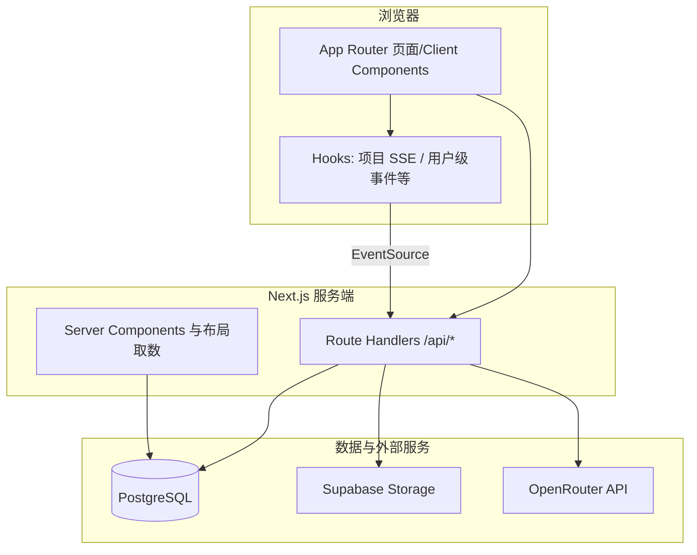
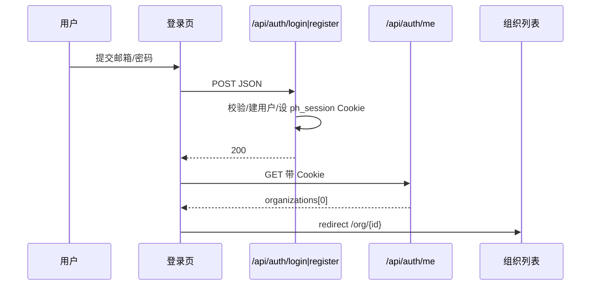
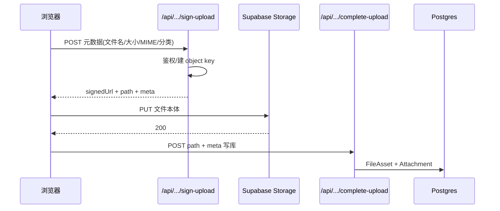

# ProjectHub 技术实现说明书

> **目的**：供学习者在理解架构与关键决策后，复刻同类「协作型项目管理 + 文件交付 + 实时同步 + 可选 AI 分析」的 Web 应用。  
> **范围**：以本仓库（Next.js 14 App Router + Prisma + Postgres + 可选 Supabase Storage + OpenRouter）为准；多实例部署下的实时增强需另行引入 Redis 等组件。

---

## 1. 整体架构

### 1.1 技术选型及理由

| 层级 | 选型 | 理由 |
|------|------|------|
| 前端框架 | **Next.js 14（App Router）** | 服务端渲染与 Route Handler 一体；API 与页面同-repo；部署到 Vercel 等平台路径清晰。 |
| UI | **React 18 + Tailwind CSS** | 组件化与原子类 rapid iteration；与设计体系一致。 |
| 语言 | **TypeScript** | 端到端类型约束，利于中大型表单与 API 契约维护。 |
| ORM | **Prisma 5 + PostgreSQL** | 迁移与 schema 即文档；Neon / Supabase Postgres / 自建均可。 |
| 认证 | **自建 JWT（jose）+ httpOnly Cookie** | 无第三方 Auth 锁定；会话天数与「记住我」可控（见 `src/lib/auth.ts`）。 |
| 密码 | **bcryptjs** | 成熟慢哈希；与 Prisma `User.passwordHash` 搭配。 |
| 文件存储 | **Supabase Storage + service role** | 对象存储 + 签名 URL；**直传**可绕开 Serverless 单请求体积极限。 |
| 富交互 | **@dnd-kit** | 看板拖拽、可访问性较好。 |
| 图表 | **Recharts** | 项目内报表/工作负载等轻量图表。 |
| 图片处理 | **sharp** | 头像压缩/转 JPEG，控制 data URL 体积。 |
| 实时 | **SSE（ReadableStream）+ 进程内 EventEmitter** | 实现简单；**单 Node 进程**内多标签页/多连接可收同步事件。水平扩展需换 **Redis Pub/Sub** 等（见 `src/lib/project-realtime.ts` 注释）。 |
| 大模型 | **OpenRouter（HTTP）** | 统一对接多厂商模型；仅服务端持 Key；可配 `HTTP-Referer` / `X-Title` 满足平台要求。 |

**不选**或**可替换**的说明：

- **不强制** Supabase 全栈：仅 Storage 用其 S3 兼容 API + 签名；数据库可仍用 Neon 等纯 Postgres。  
- **不选** NextAuth：项目需要与自管 `User` 表、组织/项目成员模型强一致。  
- **AI** 不绑 OpenAI 官方：经 OpenRouter 可切 `OPENROUTER_MODEL`（如 `deepseek/...`、`openai/...`）。

### 1.2 逻辑架构（分层）



### 1.3 核心流程

#### 1.3.1 注册 / 登录与首跳



**关键决策**：Cookie 名 `ph_session`；JWT 内含 `sub`（userId）与 `email`；`remember` 控制 1 天与 30 天两档 `maxAge`（与 `auth.ts` 中 `SESSION_SHORT_DAYS` / `SESSION_LONG_DAYS` 一致）。

#### 1.3.2 交付物直传（避免 Vercel 等 4.5MB 限制）



**关键决策**：大文件 **不经** Next Route Handler body；仅元数据与小 JSON 经过 API。

#### 1.3.3 项目内实时同步（SSE）


**关键决策**：进程内事件总线；单机多连接一致；多副本需替换为共享消息层。

---

## 2. 目录与模块职责

### 2.1 前端页面（`src/app`）

| 路径 | 作用 |
|------|------|
| `login/page.tsx` | 登录/注册切换、演示账号、忘记密码入口。 |
| `org/[orgId]/layout.tsx` | 组织上下文、导航与用户摘要。 |
| `org/[orgId]/project/[projectId]/page.tsx` | 项目工作台入口（甘特等默认视图由组件 prop 决定）。 |
| `org/[orgId]/project/[projectId]/assets/page.tsx` | 项目级交付物汇总（资源中心页面）。 |

### 2.2 API 路由（按业务域）

| 域 | 示例路径 | 说明 |
|----|---------|------|
| 认证 | `api/auth/login`, `register`, `logout`, `me`, `demo`, `forgot-password`, `reset-password` | Cookie 会话与演示账号。 |
| 组织/项目 | `api/orgs/*`, `api/projects/[projectId]/*` | CRUD、成员、分析、AI 入口。 |
| 任务 | `api/tasks/[taskId]/*` | 任务字段、评论、聊天、交付物 CRUD + **sign-upload / complete-upload**。 |
| 协作实时 | `api/projects/[projectId]/stream`, `presence` | SSE + 在线状态心跳。 |
| 私信 | `api/chat/dm/*`, `api/orgs/[orgId]/dm-threads` | 1v1 线程与消息。 |
| 存储诊断 | `api/diagnostics`, `api/me/avatar` | 自检与头像（data URL 落库）。 |

### 2.3 权限模型（`src/lib/access.ts`）

- **`requireProjectAccess`**：用户必须是该项目 `ProjectMember`。  
- **`effectiveOrgRole`**：未加入组织但已被拉进项目时按 `GUEST` 与项目角色组合判断。  
- **`canUploadDeliverable` / `canDeleteDeliverable`**：与编辑任务权限对齐，删除另有「本人或管理员」规则。

### 2.4 核心库文件

| 文件 | 职责 |
|------|------|
| `src/lib/auth.ts` | JWT 签发/校验、`getSession`、Cookie 选项。 |
| `src/lib/prisma.ts` | 单例 `PrismaClient`。 |
| `src/lib/supabase-storage.ts` | `getSupabaseAdmin()`、`getDeliverablesBucket()`。 |
| `src/lib/deliverable-helpers.ts` | MIME 分类、大小上限、文件名净化。 |
| `src/lib/project-realtime.ts` | EventEmitter、presence、`broadcastProjectSync`。 |
| `src/lib/openrouter.ts` | OpenRouter 请求头（Referer/Title）、chat completions、错误分类。 |

---

## 3. 关键实现摘录

### 3.1 环境变量（最小集）

来自 `.env.example` 思路（具体以仓库为准）：

```bash
# 数据库（迁移用直连，运行时可用 pooler）
DATABASE_URL="postgresql://..."
DIRECT_URL="postgresql://..."

JWT_SECRET="至少 16 字符"

NEXT_PUBLIC_APP_URL="https://你的域名"

# 可选：交付物直传
SUPABASE_URL="https://xxx.supabase.co"
SUPABASE_SERVICE_ROLE_KEY="..."
SUPABASE_STORAGE_BUCKET=deliverables

# 可选：项目内 AI 文本分析
OPENROUTER_API_KEY="sk-or-v1-..."
OPENROUTER_MODEL="deepseek/deepseek-v3.2"
```

### 3.2 Prisma 数据源（双 URL）

```prisma
datasource db {
  provider  = "postgresql"
  url       = env("DATABASE_URL")
  directUrl = env("DIRECT_URL")
}
```

Serverless（如 Prisma + Neon）常用 **pooler** 作为 `DATABASE_URL`，**migrate** 用 `DIRECT_URL` 直连，避免 advisory lock / P1002 等问题。

### 3.3 JWT 会话（简化片段）

```ts
// jose SignJWT → Cookie ph_session；getSession() 从 cookies() 读取并 jwtVerify
export async function getSession(): Promise<JwtPayload | null> {
  const jar = await cookies();
  const t = jar.get(COOKIE)?.value;
  if (!t) return null;
  return verifySessionToken(t);
}
```

### 3.4 SSE 端点骨架

```ts
export async function GET(req: Request, ctx: Ctx) {
  const stream = new ReadableStream({
    start(controller) {
      const send = (obj: unknown) => {
        controller.enqueue(encoder.encode(`data: ${JSON.stringify(obj)}\n\n`));
      };
      const unsub = subscribeProject(projectId, (payload) => send(payload));
      req.signal.addEventListener("abort", () => { unsub(); controller.close(); }, { once: true });
    },
  });
  return new Response(stream, {
    headers: {
      "Content-Type": "text/event-stream; charset=utf-8",
      "Cache-Control": "no-cache, no-transform",
    },
  });
}
```

### 3.5 OpenRouter 调用要点

- 仅用 **服务端** `OPENROUTER_API_KEY`。  
- `openRouterRequestHeaders(apiKey)` 附带 `HTTP-Referer`、`X-Title`（可通过环境变量省略或指定生产 URL）。  
- 项目 AI 路由：`api/projects/[projectId]/ai/analyze` 等，将自然语言解析为结构化任务 JSON，失败时返回可解析错误码便于前端提示。

---

## 4. 复刻路径建议（学习者）

1. **最小闭环**：Postgres + Prisma `User` + 登录 Cookie + 单页「项目/任务」CRUD（无实时、无文件）。  
2. **权限**：引入 `Organization` / `Project` / `ProjectMember`，所有任务 API `requireProjectAccess`。  
3. **文件**：接入 Supabase（或 MinIO）+ **sign upload URL → PUT → complete** 三跳；数据库 `FileAsset` + `Attachment`。  
4. **实时**：单进程 SSE + `broadcastProjectSync`；压测后再考虑 Redis。  
5. **AI**：接入 OpenRouter 单一路由，固定 system prompt 输出 JSON Schema 约束的任务列表。  
6. **部署**：Vercel 环境变量对齐；`maxDuration` 对大请求路由放宽；头像与 multipart 备用路径注意 body 上限。

---

## 5. 使用的 AI 工具说明

说明分两层：**① 产品研发过程** 与 **② 产品运行时内置能力**。

### 5.1 产品研发与文档（复刻时可替换）

| 环节 | 典型工具与作用 |
|------|----------------|
| 需求/说明书起草 | **大语言模型（对话式 IDE、ChatGPT、Claude 等）**：归纳功能列表、生成说明书骨架、校对术语。 |
| 编码辅助 | **Cursor / Copilot 类**：补全、重构、按描述改文件；需人工审查安全与业务逻辑。 |
| 调试与排障 | **模型辅助阅读日志、栈追踪**：缩小范围；最终以本地复现与测试为准。 |

**注意**：本节不绑定某一厂商；学习者使用任一「IDE 内 AI」或「网页对话」均可达到类似效率，关键是 **版本库与代码审查** 仍为权威来源。

### 5.2 产品运行时（本仓库已实现）

| 能力 | AI / 接口 | 作用 |
|------|-----------|------|
| 项目工作台「AI」视图：从文本批量推断任务 | **OpenRouter** → 配置的聊天模型（如 DeepSeek / GPT 系列） | 将用户粘贴的需求描述转为结构化任务字段，供预览与写入数据库。 |
| 工作报告 / 计划表等（若启用对应路由） | **OpenRouter** | 对跨任务数据生成汇总或计划草案（具体以各 `api/.../ai/...` 路由为准）。 |

**配置**：仅服务端环境变量持有 `OPENROUTER_API_KEY`；前端不暴露。未配置时相关 API 返回明确 503/提示，避免静默失败。

### 5.3 与本说明书的关系

- 复刻者**不必**使用与作者相同的 IDE AI；只需按第 1–4 节技术栈与流程实现即可。  
- 若仅需「项目管理」而不要智能分析，可**整段移除** OpenRouter 依赖与相关 Route Handlers，核心功能仍成立。

---

## 6. 附录：相关文件索引

| 主题 | 路径提示 |
|------|-----------|
| 登录页 UI | `src/app/login/page.tsx` |
| 交付物直传 | `src/app/api/tasks/[taskId]/deliverables/sign-upload/route.ts`, `complete-upload/route.ts` |
| 交付物前端 | `src/components/project/TaskDeliverablesSection.tsx` |
| 项目 SSE | `src/app/api/projects/[projectId]/stream/route.ts`, `src/hooks/useProjectRealtime.ts` |
| 数据模型 | `prisma/schema.prisma` |
| 自检接口 | `src/app/api/diagnostics/route.ts` |

---

*文档版本：与仓库 `main` 分支实现同步；若代码变更，请以实际文件为准并更新本节索引。*
